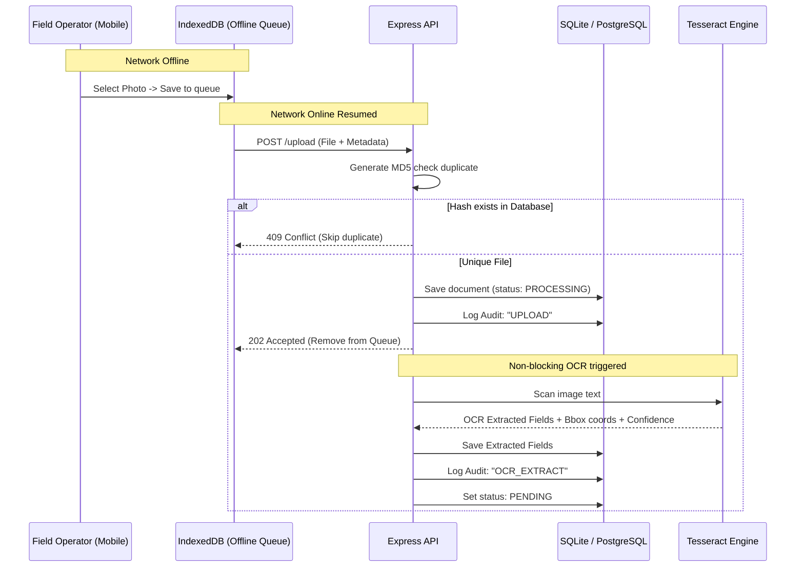

## Problem Statement

Carbon-credit projects rely on field evidence such as weighbridge slips, driver logs, and vehicle challans to validate carbon-removal activities. Manual data entry is error-prone, difficult to audit, and challenging in low-connectivity rural environments.

CarbonVerify addresses this by automating OCR extraction, enabling human verification, maintaining a complete audit trail, detecting duplicates, and supporting offline-first evidence capture.


# CarbonVerify 🌱 - auditable evidence extraction system

CarbonVerify is a production-style MVP built for carbon-credit companies to automate and audit the extraction of field evidence (weighbridge slips, driver logs, vehicle challans) captured by operators in low-connectivity rural environments.

---

## Key Capabilities Implemented

1. **Audit Logs & Traceability**: Every upload, system OCR extraction, manual change, approval, or rejection creates a persistent, chronological audit log showing exactly *who* did what, *what* changed (old vs new value), and *when* it occurred.
2. **OCR Confidence Scoring**: Custom parsing of Tesseract.js data calculates average confidence scores for weight, vehicle plate, dispatch date, and operator/driver name.
3. **Bounding Box Visualization**: Renders SVG overlay bounding boxes directly over the image, dynamically highlighting coordinates on hover of fields.
4. **Duplicate Detection**: Uses MD5 hash checksum validation to reject duplicate document uploads instantly, preserving server space and avoiding redundant OCR.
5. **Human-in-the-loop Review**: An interface allowing reviewers to verify, modify, approve, or reject OCR-extracted values, indicating manual overrides as "Corrected".
6. **Simulated Offline Sync**: Uses an IndexedDB-based sync queue in the frontend. When network is cut, files queue up in IndexedDB and sync in the background automatically when connection resumes.

---

## Assignment Requirement Mapping

| Requirement | Implementation |
|------------|---------------|
| Auditability & Traceability | Persistent audit logs |
| OCR Confidence Scoring | Tesseract confidence aggregation |
| Bounding Box Visualization | SVG overlay rendering |
| Duplicate Detection | MD5 hash validation |
| Human-in-the-loop Review | Editable verification workflow |
| Intermittent Connectivity | IndexedDB sync queue |


## Technology Stack

- **Frontend**: Vite + React + TypeScript + Tailwind CSS
- **Local Storage**: IndexedDB (using `idb` library)
- **Backend**: Node.js + Express + TypeScript
- **ORM**: Prisma ORM
- **Database**: SQLite (configured for zero-dependency, self-contained local evaluation; swap database provider to PostgreSQL in `prisma/schema.prisma` if desired).
- **OCR Engine**: Tesseract.js

---

## Folder Structure

```
InternshipAssessment/
├── backend/
│   ├── prisma/
│   │   ├── schema.prisma      # SQLite Prisma database model
│   │   └── dev.db             # Generated SQLite database
│   ├── src/
│   │   ├── routes/
│   │   │   ├── documentRoutes.ts  # Upload, metrics, search, review API
│   │   │   └── userRoutes.ts      # Seeding mock users for Audit trails
│   │   ├── services/
│   │   │   └── ocrService.ts      # Tesseract.js image-text pattern parser
│   │   ├── utils/
│   │   │   └── hash.ts            # MD5 file hash generator
│   │   ├── db.ts                  # Database client
│   │   └── index.ts               # Express startup script
│   ├── uploads/               # Image upload store
│   ├── tsconfig.json
│   └── package.json
├── frontend/
│   ├── src/
│   │   ├── components/
│   │   │   └── Header.tsx         # Network & role selector
│   │   ├── context/
│   │   │   └── UserContext.tsx    # Mock login management
│   │   ├── lib/
│   │   │   └── syncQueue.ts       # IndexedDB background queue sync
│   │   ├── pages/
│   │   │   ├── Capture.tsx        # Mobile operator view
│   │   │   ├── ReviewBoard.tsx    # Dashboard & search metrics
│   │   │   └── DocumentDetail.tsx # Verification & Bounding Box overlay
│   │   ├── App.tsx                # Routing & Background Sync worker
│   │   ├── index.css              # Glassmorphic Tailwind custom CSS
│   │   └── main.tsx
│   ├── index.html
│   ├── tailwind.config.js
│   ├── postcss.config.js
│   └── package.json
├── weighbridge_slip_evidence.png  # Generated weighbridge ticket for evaluation
└── README.md
```

---

## Architecture & Data Flow



---

## Setup Instructions

### 1. Prerequisite
Ensure [Node.js (v18 or higher)](https://nodejs.org/) is installed on your local machine.

### 2. Backend Installation & Run
Open a terminal in the project root:
```bash
cd backend
npm install
npx prisma db push
npm run dev
```
The backend server will run on `${API_URL}`. It automatically seeds mock users on launch.

### 3. Frontend Installation & Run
Open another terminal in the project root:
```bash
cd frontend
npm install
npm run dev
```
The React frontend app will start on `http://localhost:5173`. Open this URL in your browser.

---

## Tradeoff Analysis

1. **SQLite vs PostgreSQL**: We switched the database driver to SQLite for the MVP. This permits instant, zero-setup local runs without requiring any running postgres server daemon on the testing machine, whilst keeping the exact same Prisma interface which can be switched back to PostgreSQL by changing the `provider` line in `schema.prisma`.
2. **Text Regex Parsing vs LLM Processing**: For OCR field localization, we utilized pattern matching regex over extracted lines. While LLM-based OCR is more robust to general invoice layouts, regex parsing runs completely locally inside Tesseract node module with zero external API dependencies or fees, which fits low-cost MVP parameters.
3. **Simulated Sync Queue vs Service Worker Background Sync**: Standard background sync API is not fully supported across iOS and low-end Android mobile browsers. A custom IndexedDB queue with reactive React hooks offers predictable behavior, simple debugging, and maximum cross-browser portability.

---

## Assumptions Section

1. **Role Access Control**: The app includes a mock user switcher in the header. We assume that proper Authentication (JWT/cookies) is a secondary issue for this audit-focused MVP, and simulated sessions are sufficient to test the audit trail logs showing who changed what.
2. **Tesseract.js Accuracy**: Low-end field cameras may generate blurred images. The application assumes that human verification is a expected step, which is why the bounding box visual overlay and low-confidence indicators are prominent in the human-in-the-loop review workflow.


## Future Enhancements

- JWT-based authentication and RBAC
- PostgreSQL production deployment
- AI-assisted document classification
- Service Worker background synchronization
- Multi-document batch processing
